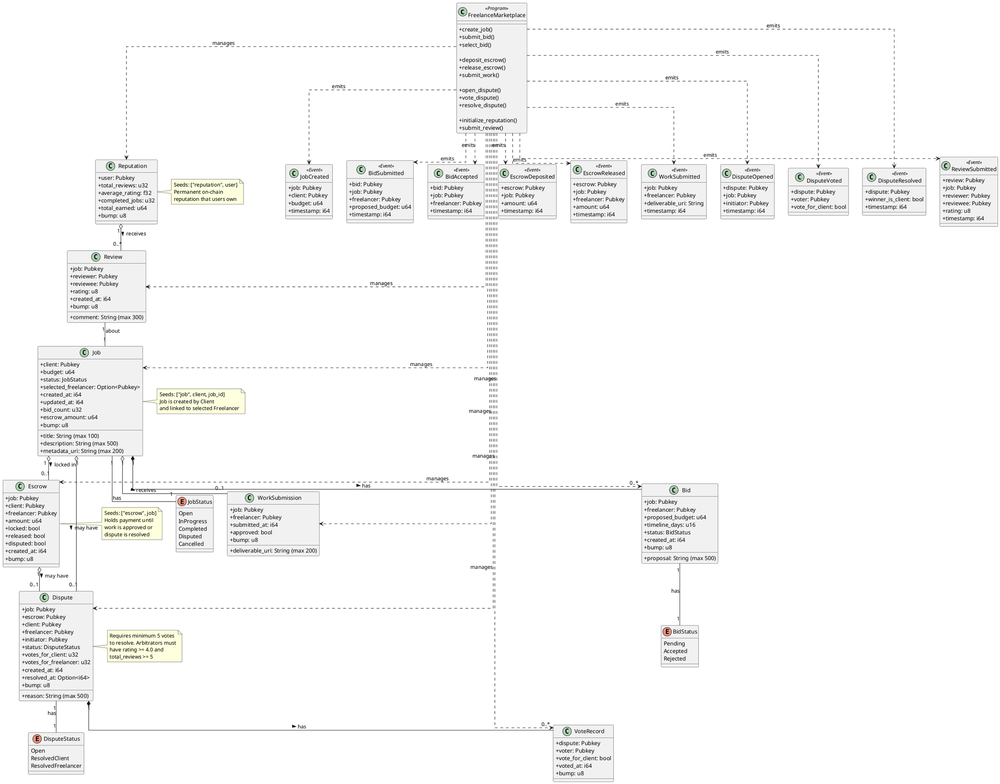

# Class Diagram - Decentralized Freelance Marketplace

## Smart Contract Architecture

This diagram shows the structure of the Solana smart contract program including all state accounts, their relationships, and the main program functions.

## PlantUML Diagram

## Component Descriptions

### Core Smart Contract Components

#### 1. Job Manager
- **Purpose**: Manages job lifecycle from creation to completion
- **Key Functions**:
  - `create_job()`: Creates new job posting
  - `submit_bid()`: Allows freelancers to bid
  - `select_bid()`: Client selects winning bid

#### 2. Escrow Manager
- **Purpose**: Handles payment locking and release
- **Key Functions**:
  - `deposit_escrow()`: Client deposits payment
  - `release_escrow()`: Release payment to freelancer
  - `submit_work()`: Freelancer submits deliverables

#### 3. Dispute Manager
- **Purpose**: Facilitates decentralized dispute resolution
- **Key Functions**:
  - `open_dispute()`: Initiate dispute
  - `vote_dispute()`: Arbitrators vote
  - `resolve_dispute()`: Execute resolution

#### 4. Reputation Manager
- **Purpose**: Tracks on-chain reputation
- **Key Functions**:
  - `initialize_reputation()`: Create reputation account
  - `submit_review()`: Submit rating and review

### State Accounts

All accounts use Program Derived Addresses (PDAs) with specific seeds:

| Account | Seeds | Description |
|---------|-------|-------------|
| Job | `["job", client, job_id]` | Job posting data |
| Bid | `["bid", job, freelancer]` | Freelancer proposal |
| Escrow | `["escrow", job]` | Payment lockbox |
| WorkSubmission | `["work", job]` | Deliverables |
| Dispute | `["dispute", job]` | Dispute case |
| VoteRecord | `["vote", dispute, voter]` | Arbitrator vote |
| Reputation | `["reputation", user]` | User reputation |
| Review | `["review", job, reviewer]` | Rating/review |

### Key Design Patterns

1. **Escrow Pattern**: Funds locked in smart contract until conditions met
2. **State Machine**: Jobs transition through defined states
3. **Event-Driven**: All actions emit events for indexing
4. **Reputation System**: Permanent on-chain reputation
5. **Decentralized Governance**: Community-driven dispute resolution

## Constraints and Validations

- Title: max 100 characters
- Description: max 500 characters
- Proposal: max 500 characters
- Comment: max 300 characters
- Rating: 1-5 stars
- Minimum votes for dispute: 5
- Arbitrator requirements: rating >= 4.0, reviews >= 5
