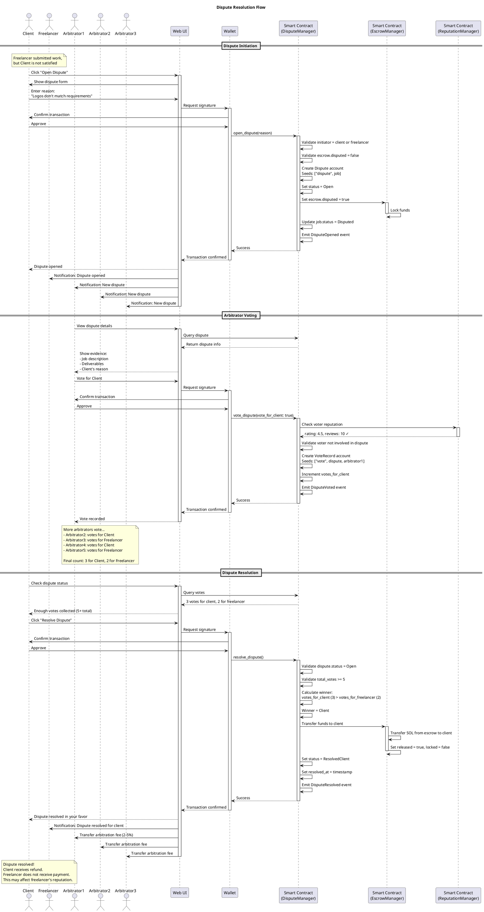
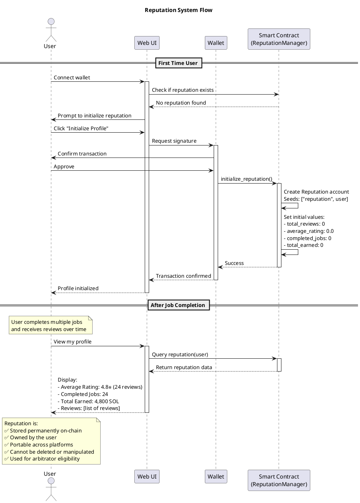

# Sequence Diagrams - Decentralized Freelance Marketplace

## 1. Complete Job Flow (Happy Path)

This sequence diagram shows the complete flow from job posting to completion without disputes.

```plantuml
@startuml
title Complete Job Flow - Logo Design Example

actor Client
actor Freelancer
participant "Web UI" as UI
participant "Wallet\n(Phantom)" as Wallet
participant "Smart Contract\n(JobManager)" as Job
participant "Smart Contract\n(EscrowManager)" as Escrow
participant "Smart Contract\n(ReputationManager)" as Reputation
participant "IPFS" as IPFS

== Job Posting ==
Client -> UI: Click "Post Job"
activate UI
UI -> Client: Show job form
Client -> UI: Fill details\n(Title: "Logo Design"\nBudget: 200 SOL)
UI -> Wallet: Request signature
activate Wallet
Wallet -> Client: Confirm transaction
Client -> Wallet: Approve
Wallet -> Job: create_job(job_id, title, description, budget, metadata_uri)
activate Job
Job -> Job: Validate inputs\n(title <= 100 chars, budget > 0)
Job -> Job: Create Job account\nSeeds: ["job", client, job_id]
Job -> Job: Set status = Open
Job -> Job: Emit JobCreated event
Job --> Wallet: Success
deactivate Job
Wallet --> UI: Transaction confirmed
deactivate Wallet
UI --> Client: Job posted successfully
deactivate UI

== Freelancer Bidding ==
Freelancer -> UI: Browse jobs
activate UI
UI -> Job: Query open jobs
Job --> UI: Return job list
UI --> Freelancer: Display jobs
Freelancer -> UI: View job details
Freelancer -> UI: Click "Submit Bid"
UI -> Freelancer: Show bid form
Freelancer -> UI: Enter proposal\n(Budget: 180 SOL\nTimeline: 5 days)
Freelancer -> IPFS: Upload portfolio samples
activate IPFS
IPFS --> Freelancer: Return IPFS hash
deactivate IPFS
Freelancer -> Wallet: Request signature
activate Wallet
Wallet -> Freelancer: Confirm transaction
Freelancer -> Wallet: Approve
Wallet -> Job: submit_bid(proposed_budget, proposal, timeline_days)
activate Job
Job -> Job: Validate job.status = Open
Job -> Job: Create Bid account\nSeeds: ["bid", job, freelancer]
Job -> Job: Increment job.bid_count
Job -> Job: Emit BidSubmitted event
Job --> Wallet: Success
deactivate Job
Wallet --> UI: Transaction confirmed
deactivate Wallet
UI --> Freelancer: Bid submitted
deactivate UI

note over Client, Freelancer: 4 more freelancers submit bids...

== Client Selects Freelancer ==
Client -> UI: View bids
activate UI
UI -> Job: Query bids for job
Job --> UI: Return 5 bids
UI --> Client: Display bids with ratings
Client -> UI: Select Designer A's bid
UI -> Wallet: Request signature
activate Wallet
Wallet -> Client: Confirm transaction
Client -> Wallet: Approve
Wallet -> Job: select_bid(bid_id)
activate Job
Job -> Job: Validate job.status = Open
Job -> Job: Validate bid.status = Pending
Job -> Job: Set job.selected_freelancer = Designer A
Job -> Job: Set job.status = InProgress
Job -> Job: Set bid.status = Accepted
Job -> Job: Emit BidAccepted event
Job --> Wallet: Success
deactivate Job
Wallet --> UI: Transaction confirmed
deactivate Wallet
UI --> Client: Freelancer selected
deactivate UI

== Escrow Deposit ==
Client -> UI: Click "Deposit Payment"
activate UI
UI -> Wallet: Request signature
activate Wallet
Wallet -> Client: Confirm 180 SOL transfer
Client -> Wallet: Approve
Wallet -> Escrow: deposit_escrow(amount: 180 SOL)
activate Escrow
Escrow -> Escrow: Validate amount >= job.budget
Escrow -> Escrow: Transfer SOL to escrow PDA
Escrow -> Escrow: Create Escrow account\nSeeds: ["escrow", job]
Escrow -> Escrow: Set locked = true, released = false
Escrow -> Escrow: Update job.escrow_amount
Escrow -> Escrow: Emit EscrowDeposited event
Escrow --> Wallet: Success
deactivate Escrow
Wallet --> UI: Transaction confirmed
deactivate Wallet
UI --> Client: Funds locked in escrow
UI -> Freelancer: Notification: Job started
deactivate UI

== Work Submission ==
Freelancer -> UI: Upload deliverables
activate UI
Freelancer -> IPFS: Upload 3 logo designs
activate IPFS
IPFS --> Freelancer: Return IPFS hash
deactivate IPFS
UI -> Wallet: Request signature
activate Wallet
Wallet -> Freelancer: Confirm transaction
Freelancer -> Wallet: Approve
Wallet -> Escrow: submit_work(deliverable_uri)
activate Escrow
Escrow -> Escrow: Validate freelancer = job.selected_freelancer
Escrow -> Escrow: Validate job.status = InProgress
Escrow -> Escrow: Create WorkSubmission account\nSeeds: ["work", job]
Escrow -> Escrow: Store deliverable_uri (IPFS hash)
Escrow -> Escrow: Emit WorkSubmitted event
Escrow --> Wallet: Success
deactivate Escrow
Wallet --> UI: Transaction confirmed
deactivate Wallet
UI --> Freelancer: Work submitted
UI -> Client: Notification: Work ready for review
deactivate UI

== Work Approval & Payment Release ==
Client -> UI: Review deliverables
activate UI
Client -> IPFS: Download files
activate IPFS
IPFS --> Client: Return logo designs
deactivate IPFS
Client -> UI: Click "Approve Work"
UI -> Wallet: Request signature
activate Wallet
Wallet -> Client: Confirm transaction
Client -> Wallet: Approve
Wallet -> Escrow: release_escrow()
activate Escrow
Escrow -> Escrow: Validate client = job.client
Escrow -> Escrow: Validate escrow.locked = true
Escrow -> Escrow: Validate escrow.disputed = false
Escrow -> Escrow: Transfer SOL from escrow to freelancer
Escrow -> Escrow: Set escrow.released = true, locked = false
Escrow -> Job: Set job.status = Completed
Escrow -> Escrow: Emit EscrowReleased event
Escrow --> Wallet: Success
deactivate Escrow
Wallet --> UI: Transaction confirmed
deactivate Wallet
UI --> Client: Payment released
UI -> Freelancer: Notification: Payment received!
deactivate UI

== Rating & Review ==
Client -> UI: Submit review
activate UI
UI -> Wallet: Request signature
activate Wallet
Wallet -> Client: Confirm transaction
Client -> Wallet: Approve
Wallet -> Reputation: submit_review(rating: 5, comment: "Excellent work!")
activate Reputation
Reputation -> Reputation: Validate job.status = Completed
Reputation -> Reputation: Validate rating 1-5
Reputation -> Reputation: Create Review account\nSeeds: ["review", job, client]
Reputation -> Reputation: Update freelancer reputation:\n- total_reviews += 1\n- recalculate average_rating\n- completed_jobs += 1
Reputation -> Reputation: Emit ReviewSubmitted event
Reputation --> Wallet: Success
deactivate Reputation
Wallet --> UI: Transaction confirmed
deactivate Wallet
UI --> Client: Review submitted
deactivate UI

Freelancer -> UI: Submit review for client
activate UI
UI -> Wallet: Request signature
activate Wallet
Wallet -> Freelancer: Confirm transaction
Freelancer -> Wallet: Approve
Wallet -> Reputation: submit_review(rating: 5, comment: "Great client!")
activate Reputation
Reputation -> Reputation: Create Review account
Reputation -> Reputation: Update client reputation
Reputation -> Reputation: Emit ReviewSubmitted event
Reputation --> Wallet: Success
deactivate Reputation
Wallet --> UI: Transaction confirmed
deactivate Wallet
UI --> Freelancer: Review submitted
deactivate UI

note over Client, Freelancer
  Job completed successfully!
  Reviews are permanently stored on-chain.
  Both parties maintain their reputation.
end note

@enduml
```

## 2. Dispute Resolution Flow

This sequence diagram shows what happens when a dispute arises.

## 3. Reputation Building Flow

## Key Flows Summary

### 1. Happy Path (No Disputes)
1. Client posts job → Job created on-chain
2. Freelancers submit bids → Bids stored on-chain
3. Client selects freelancer → Job status = InProgress
4. Client deposits funds → Escrow locked
5. Freelancer submits work → Deliverables on IPFS
6. Client approves work → Payment auto-released
7. Both parties review → Reputation updated

**Duration**: Instant payments, ~minutes for confirmation

### 2. Dispute Path
1. Either party opens dispute → Funds locked
2. Arbitrators (high reputation users) review evidence
3. Minimum 5 arbitrators vote → Majority decides
4. Smart contract auto-executes → Funds to winner
5. Arbitrators receive fee → 2-5% of escrow

**Duration**: Depends on arbitrator participation (typically 24-72 hours)

### 3. Reputation Building
- Initialize once per user
- Updated after each completed job
- Reviews are immutable
- Used for arbitrator eligibility (rating >= 4.0, reviews >= 5)
- Owned by user forever

## Technical Notes

### PDA Seeds Reference
- Job: `["job", client, job_id]`
- Bid: `["bid", job, freelancer]`
- Escrow: `["escrow", job]`
- Work: `["work", job]`
- Dispute: `["dispute", job]`
- Vote: `["vote", dispute, voter]`
- Reputation: `["reputation", user]`
- Review: `["review", job, reviewer]`

### Event Emissions
Every state change emits events for:
- Frontend real-time updates
- Blockchain indexing
- Analytics and monitoring
- Audit trail

### Security Features
- All funds held in escrow PDA (Program Derived Address)
- Only authorized parties can release funds
- Reputation requirements for arbitrators
- Cannot vote on own disputes
- Minimum vote threshold prevents gaming
