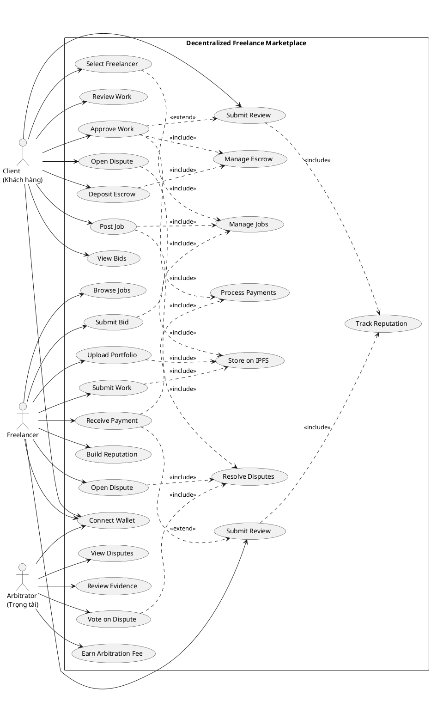

# Use Case Diagram - Decentralized Freelance Marketplace

## Actors
- **Client (Khách hàng)**: Person who posts jobs and hires freelancers
- **Freelancer**: Person who bids on and completes jobs
- **Arbitrator (Trọng tài)**: Community members who vote on disputes

## Use Cases

### Client Use Cases
1. **Connect Wallet**: Connect wallet (Phantom/MetaMask) to authenticate
2. **Post Job**: Create and publish a job with budget and description
3. **Deposit Escrow**: Deposit payment into smart contract escrow
4. **View Bids**: Browse and review freelancer proposals
5. **Select Freelancer**: Choose a winning bid and assign job
6. **Review Work**: Download and review submitted deliverables
7. **Approve Work**: Approve work to release payment
8. **Submit Review**: Rate and review freelancer
9. **Open Dispute**: Initiate dispute if not satisfied

### Freelancer Use Cases
1. **Connect Wallet**: Connect wallet to authenticate
2. **Browse Jobs**: Search and filter available jobs
3. **Submit Bid**: Create proposal with price and timeline
4. **Upload Portfolio**: Attach work samples via IPFS
5. **Submit Work**: Upload deliverables when job is assigned
6. **Receive Payment**: Get instant payment when work is approved
7. **Submit Review**: Rate and review client
8. **Build Reputation**: Accumulate on-chain reviews and ratings
9. **Open Dispute**: Initiate dispute if payment issues occur

### Arbitrator Use Cases
1. **Connect Wallet**: Connect wallet to authenticate
2. **View Disputes**: Browse open disputes
3. **Review Evidence**: Examine dispute details and evidence
4. **Vote on Dispute**: Cast vote for client or freelancer
5. **Earn Arbitration Fee**: Receive compensation for participation

## System Use Cases
- **Manage Jobs**: Create, update, track job status
- **Manage Escrow**: Lock, release, or refund payments
- **Process Payments**: Execute automatic payments via smart contract
- **Track Reputation**: Calculate and store on-chain reputation
- **Resolve Disputes**: Facilitate community-driven dispute resolution
- **Store on IPFS**: Store files and metadata on decentralized storage

## PlantUML Diagram

## Relationships

### Include Relationships
- Post Job includes Manage Jobs and Store on IPFS
- Deposit Escrow includes Manage Escrow
- Approve Work includes Manage Escrow and Process Payments
- Submit Review includes Track Reputation
- Submit Bid includes Manage Jobs
- Upload Portfolio includes Store on IPFS
- Submit Work includes Store on IPFS

### Extend Relationships
- Submit Review extends Approve Work (optional)
- Submit Review extends Receive Payment (optional)

## Notes
- All actors must Connect Wallet before performing any actions
- Reputation is permanently stored on-chain
- Payments are instant and automatic via smart contracts
- Disputes are resolved by community voting
- All files are stored on IPFS for decentralization
